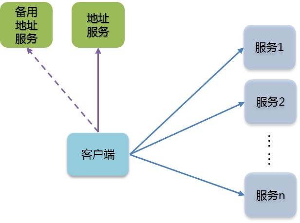

轻量级RMISDK
----------

### 1. 用途

做算法的同学常常需要将做好的算法包装成服务，接受业务端请求，返回计算结果。RMISDK的目标是简化算法服务的上线过程，提供快速、稳定、可扩展的长连接服务。它的优点如下：

* 根据访问量的不同，可动态扩展至任意服务数量，支持多线程调用客户端
* 客户端从地址服务器自动刷新业务服务器的地址，均衡访问各个业务服务器
* 客户端自动检测各个业务服务的有效性，删除无效服务，添加新的有效服务
* 支持备用地址服务器，大大降低地址服务器宕机导致的风险

### 2. 使用方法

* 配置业务服务器的地址列表（可动态更改），启动地址和备用地址服务（推荐部署在两台不同的机器上）
* 包装业务服务代码，根据总体QPS的需要启动多个业务服务器
* 包装客户端代码，只需配置地址服务器和备用地址服务器的地址（无需关心业务服务器地址）
* 代码样例请见sample文件夹

 